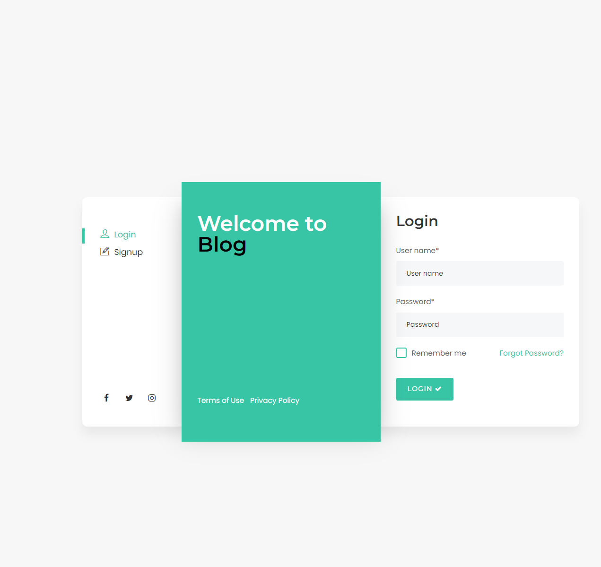

# Blog

## 기술스택

## 개발기간

- 2023년 7일 17일 ~ 2023년 7월 20일

## 기능(URL/Method) 설계

- Index - ["/", GET]
- Login - ["/user/login/", GET, POST]
- Signup - ["/user/signup/", GET, POST]
- Blog Main - ["/blog/", GET]
- Post Write - ["/blog/write/", GET, POST]
- Post Detail - ["/blog/<int:post.id>/", GET]
- Post Edit - ["/blog/<int:post.id>/edit/", GET, POST]
- Post Delete - ["/blog/<int:post.id>/delete/", POST]
- Comment Wirte - ["/blog/<int:post.id>/comment/write/", POST]
- Comment Delete - ["/blog/comment/<int:comment.id>/delete/", POST]
- Comment Search - ["/blog/search/?query=name/", GET]
- Tag Wirte -["/blog/<int:post.id>/tag/write", POST]
- Tag Search - ["/blog/tag-search/?query=name/", GET]
- Tag Delete - 글 작성 페이지에 태그 작성란이 포함되어 있어 수정 시 덮어씌우는 방법으로 삭제 기능 대체

## 데이터베이스(Model) 설계

- User - Post = 1:N
- Post - Comment = 1:N
- Post - Tag = M:N

처음에는 단순하게 Post와 Tag를 1:N의 관계로 잡았으나, Tag로 Post를 검색하는 기능을 고려해보면 M:N으로 관계를 잡는 것이 효율적이라고 판단되어 교체

## 프로젝트 중점 사항

지체되는 구간 너무 많지 없도록 적절한 일정 분배로 주어진 기간 안에 프로젝트를 완성시키는 것이 최우선 순위, 의미있는 단위로 Commit 해가며 체계적으로 프로젝트 진행하기

## 상세 구현 페이지

1. 로그인 페이지
   

2. 회원가입 페이지
   

3. Blog 진입 링크
   

3곳의 링크를 한 곳에 모아 인덱스 페이지를 구성하였습니다.
성공적으로 회원가입이 완료되면 로그인 페이지로 넘어가고, 로그인도 성공하면 메인 블로그 페이지로 넘어갑니다.

4. Main Blog 페이지
   

5. Main Blog 페이지(2)
   

현재는 로그인된 상태이기 떄문에, 우측 상단 로그아웃 버튼이 활성화 되어있습니다. 오른쪽 돋보기 아이콘은 제목으로 게시글을 찾아볼 수 있는 검색창입니다.

기본적으로 게시글은 제목, 내용, 작성자, 작성일자로 구성되어 있지만 사진이 있는 게시글의 경우 첫번째 사진이 보여지도록 하여 사진이 없는 게시글과 약간의 차이를 두었습니다.

우측에 보이는 Tags는 게시글에 작성된 태그들의 모음으로 각 태그를 누르면 해당 태그가 포함된 게시글들을 모아볼 수 있습니다.

6. Post Edit
   
   
   

Post 작성과 수정은 TOAST UI Editor를 이용해 강력한 기능을 간편하게 구현할 수 있었습니다. 다만 기존에 정의한 Form이 아니기 때문에 값을 전달받으려면 hidden input을 하나 만들어 내용의 변화가 있을 때마다 갱신하여 넣어주어야 했습니다.

7. Post Detail 페이지 - 댓글 기능 + Delete 기능
   
   현재 admin 계정으로 접속한 상태라 작성한 게시글의 수정 및 삭제가 가능하고, 댓글도 admin 계정의 댓글만 삭제가 가능한 상태입니다. 이 상태에서 게시글을 지우더라도 db에서 삭제하지 않고 is_deleted 필드를 True로 바꿔 목록 창에서만 보이지 않도록 처리하였습니다. is_deleted가 True인 게시글은 삭제 처리된 게시글이기 때문에 접속을 하게 되면 아래와 같이 "존재하지 않는 게시글"이라는 문구를 보여주는 페이지로 넘겨주었습니다.
   

8. Search 페이지 - 제목 검색 + 태그 검색
   
   
   제목 검색은 제목에 해당 쿼리가 포함되는 게시글들을 가져오도록 하였고, 태그 검색은 해당 태그와 연결된 post를 모두 가져오도록 하였습니다.

9. Post 작성 페이지 - 로그아웃 기능
   
   
   
   작성된 페이지를 보면 처음엔 로그인된 상태라 게시글 수정과 삭제 버튼, 우측 상단에 로그아웃 버튼이 있지만 로그아웃을 이후에는 수정과 삭제 버튼이 사라지고, 로그인과 회원가입 버튼이 나타나도록 하였습니다.

## 보완해야 할 부분

조회수 기능, 프로필 기능, 대댓글 기능, 배포
